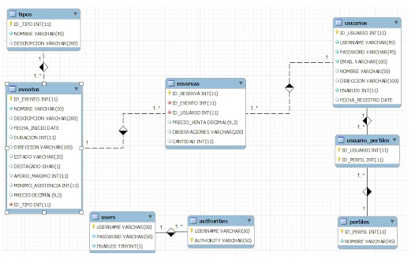

# AD1-Entorno-Servidor

Una empresa se dedica a montar eventos. Cada evento es de un tipo distinto. Los tipos de evento son: concierto, despedida, cumpleaños, boda…, y nos interesa un código que identifique cada evento junto con su descripción. A un evento se inscriben clientes, de los que debemos guardar el esquema SQL. Recuerda que un cliente puede apuntarse a más de un evento. 

De aquí en adelante, podremos incorporar más tablas para completar la aplicación, pero, de momento, con estas tenemos bastantes.

El modelo de datos es el siguiente: 

 

Desarrollo

La idea es que construyamos una aplicación con SpringBoot y Thymeleaf sin acceso a datos, es decir con listas,  y cuya página principal tenga esta imagen (index.html). 

 

Vamos a implementar el controlador EventosController y HomeController.
Las páginas HTML (con thymeleaf) necesarias para las tareas definidas a continuación.
La clase de Bean 'Evento' y 'Tipo', a partir de las tablas que tienes en este enunciado.
Ojo, un Evento tiene una variable Tipo tipo, no un int idTipo.
El interface TipoDao con dos métodos, findAll() y findById(), y la clase que implementa este interface.
El interface llamado EventoDao de la clase 'Evento' con los métodos necesarios.
Una clase EventoDaoImpl, que contiene una lista de eventos con su tipo y la implementación de los métodos del interface.
 

Del controlador llamado HomeController tratamos las siguientes opciones:
“/” ->  Sacar el listado de la imagen superior.
Del controlador llamado EventoController tratamos las siguientes opciones:
“/eventos/alta: -> Mostrar un formulario con los datos del evento, poner el estado del evento como ‘ACTIVO’ y, si quieres destacarlo, poner una ‘s’ en su columna. Volver al listado de activos.
“/eventos/editar/{id} “ -> Mostrar en un HTML con los datos del evento.
“/eventos/eliminar/{id} “ ->  Borrarlo de la clase que contiene los eventos y volver al listado de activos.
“/eventos/cancelar/{id}“ ->  Poner el estado del evento como "CANCELADO", y volver al listado de activos. Comprobar con un "syso" por consola que este evento tiene el estado a "CANCELADO". 
De momento no nos preocupamos de quién entra en la aplicación. Vamos a suponer que entra a la aplicación un administrador que tiene permisos para probar todas las tareas que se proponen.
